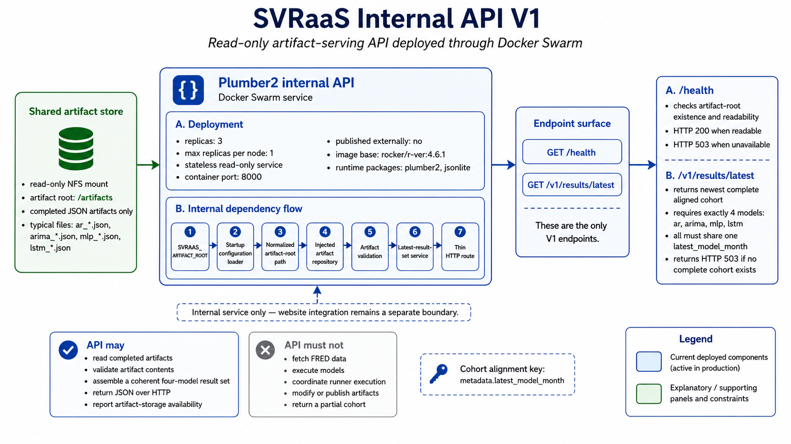

# SVRaaS Internal API V1

> **Status:** Implemented, tested, containerized, and deployed through Docker Swarm
> **Scope:** Internal, read-only API for completed SVRaaS model artifacts

This document records the implemented API V1 behavior. The broader current system architecture is documented in `docs/architecture.md`.

## Purpose

The SVRaaS API provides a small HTTP interface between completed model-runner artifacts and downstream consumers.

Its current purpose is to:

- Confirm that configured artifact storage is available.
- Discover and safely read completed model artifacts.
- Validate supported artifacts.
- Identify the newest complete result cohort aligned to one model month.
- Return that cohort as JSON.

The API is intentionally narrow. It does not run models, retrieve source data, or orchestrate refreshes.

## V1 endpoint surface

| Method | Path                 | Purpose                                                   |
| ------ | -------------------- | --------------------------------------------------------- |
| `GET`  | `/health`            | Report API and artifact-root availability.                |
| `GET`  | `/v1/results/latest` | Return the newest complete aligned four-model result set. |



These are the only V1 endpoints.

## Architectural boundaries

The API may:

- Read completed JSON artifacts.
- Validate completed artifacts.
- Assemble a coherent four-model result set.
- Return JSON over HTTP.
- Report whether configured artifact storage is available.

The API must not:

- Retrieve FRED or other source data.
- Detect whether new monthly data has been released.
- Execute any model runner.
- Coordinate runner execution.
- Modify or publish artifacts.
- Return a partial model cohort.
- Expose arbitrary filesystem paths.
- Provide public authentication or rate limiting.

Source-data monitoring, refresh decisions, model execution, and artifact writing belong to the persistent model runner.

Website routing, TLS termination, authentication, rate limiting, and other presentation-layer concerns are outside API V1.

## Internal dependency flow

The implemented dependency flow is:

1. `SVRAAS_ARTIFACT_ROOT`
2. Startup configuration loader
3. Normalized artifact-root path
4. Injected artifact repository
5. Artifact validation
6. Latest-result-set service
7. Thin HTTP route

The result-set service remains independent of HTTP behavior. The `/v1/results/latest` route calls the service rather than searching the filesystem directly.

## R dependencies

The API uses `plumber2`, not the original `plumber` package.

The complete development and test dependency set is:

```r
install.packages(c(
  "plumber2",
  "jsonlite",
  "testthat",
  "httr2",
  "callr",
  "httpuv",
  "withr"
))
```

The last three packages support the live HTTP integration-test harness.

Verify the installed versions with:

```r
packages <- c(
  "plumber2",
  "jsonlite",
  "testthat",
  "httr2",
  "callr",
  "httpuv",
  "withr"
)

setNames(
  lapply(packages, packageVersion),
  packages
)
```

Do not install for this V1 implementation:

- `plumber`
- `plumberDeploy`
- `plumbr`
- `rsconnect`

Postman is optional and is not required for local development or validation.

## Artifact-root configuration

The API obtains its artifact location from:

```text
SVRAAS_ARTIFACT_ROOT
```

The artifact root must not be hard-coded in repository functions.

The configured artifact root must be an absolute path.

The environment variable is:

- Read once during API startup.
- Normalized once.
- Passed explicitly to the artifact repository.
- Reused for the life of the API process.

The intended construction pattern is:

```r
repository <- new_artifact_repository(
  artifact_root = config$artifact_root
)
```

Repository operations must not repeatedly call `Sys.getenv()` and must not use `getwd()` as the artifact-storage contract.

Changing `SVRAAS_ARTIFACT_ROOT` requires restarting and reparsing the API.

### Windows development example

Set the environment variable in R before parsing `plumber.R`:

```r
Sys.setenv(
  SVRAAS_ARTIFACT_ROOT = "C:/path/to/svraas/artifacts"
)
```

Forward slashes are recommended in R paths on Windows.

The current Windows username or development path must never be committed to source code or returned by an endpoint.

### PowerShell example

The variable can instead be set for the current PowerShell process before starting R:

```powershell
$env:SVRAAS_ARTIFACT_ROOT = "C:\path\to\svraas\artifacts"
```

### Container deployment

The deployed API configuration is:

```text
SVRAAS_ARTIFACT_ROOT=/artifacts
```

The API receives `/artifacts` through a read-only mount of the shared NFS artifact store.

The model runner uses the shared artifact store read/write, while the API uses it read-only.

The API treats `/artifacts` as an ordinary filesystem path and does not need NFS-specific logic.

### Supported storage arrangements

The configuration boundary allows the API to target:

- An absolute local development directory.
- An absolute Docker-mounted filesystem path.
- An absolute shared-storage mount path such as `/artifacts`.

No R source-code change should be required when the storage location changes.

## Docker Swarm deployment

The Plumber2 API is packaged and deployed as its own Docker Swarm service.

The current deployment uses:

```text
replicas: 3
max replicas per node: 1
artifact mount: shared NFS read-only
artifact root: /artifacts
NFS version: 4.1
container port: 8000
published Swarm port: none
image reference: immutable GHCR digest
```

The API is stateless and read-only, allowing multiple replicas to serve the same completed artifact set.

The current Swarm stack does not publish port `8000`, so the service remains internal while the website integration boundary is still being designed.

## Artifact expectations

The API reads the standardized JSON artifacts produced by these four runners:

| API key | Artifact model name | Typical filename prefix |
| ------- | ------------------- | ----------------------- |
| `ar`    | `SVR-AR`            | `ar_`                   |
| `arima` | `SVR-ARIMA`         | `arima_`                |
| `mlp`   | `SVR-MLP`           | `mlp_`                  |
| `lstm`  | `SVR-LSTM`          | `lstm_`                 |

A typical filename is:

```text
ar_20260731T172751Z.json
```

The current supported schema version is the string:

```json
"1.0"
```

Every valid artifact must contain these top-level sections:

```text
schema_version
metadata
metrics
selected_models
predictions
```

Metadata used by the repository and result-set service includes:

- `run_id`
- `model_name`
- `generated_at_utc`
- `latest_model_month`

Malformed JSON, unsupported schema versions, incorrect model identities, missing required sections, and incomplete artifacts cannot participate in a returned cohort.

Artifact filenames are an internal repository concern, not part of the HTTP contract.

## Complete-cohort rules

`GET /v1/results/latest` must return exactly one valid artifact for each expected model:

1. AR
2. ARIMA
3. MLP
4. LSTM

All four returned artifacts must share the same:

```text
metadata.latest_model_month
```

The models execute sequentially as separate `Rscript` processes, and each model produces its own artifact. Their `run_id` and `generated_at_utc` values therefore do not need to match.

The model month—not the cross-model run ID—is the cohort-alignment key.

The service must not independently take the newest file from each model and combine those files when their model months differ.

Conceptually, selection proceeds by:

1. Discovering candidate JSON artifacts.
2. Reading them safely.
3. Rejecting malformed or invalid artifacts.
4. Identifying available model months.
5. Requiring all four expected models for a candidate month.
6. Selecting the newest complete aligned month.
7. Returning the artifacts in stable key order:
   `ar`, `arima`, `mlp`, `lstm`.

If no complete valid cohort exists, the service returns no partial data and the endpoint responds with `HTTP 503`.

When more than one valid artifact exists for the same model and month, the exact latest-artifact tie-breaking behavior remains an internal repository detail rather than part of the HTTP contract.

## Running the API locally

Run the API from the repository’s `api` directory.

First configure the artifact root:

```r
Sys.setenv(
  SVRAAS_ARTIFACT_ROOT = "C:/path/to/svraas/artifacts"
)
```

Then parse and run the service:

```r
parsed_api <- plumber2::api(
  "plumber.R",
  doc_type = NULL
)

plumber2::api_run(
  parsed_api,
  host = "127.0.0.1",
  port = 8000,
  block = TRUE,
  showcase = FALSE
)
```

The examples use port `8000`. Another available port may be used if necessary.

Binding to `127.0.0.1` keeps the development service on the local machine. Stop the blocking server with the normal R interrupt command or `Ctrl+C`, depending on how R was started.

## `GET /health`

### Health Endpoint Purpose

`GET /health` verifies that:

- The API process is responding.
- Startup configuration loaded successfully.
- The configured artifact root exists.
- The configured artifact root is readable.

A served health response implies that the API configuration was parsed successfully.

The endpoint does not require model artifacts to exist. An existing, readable, but empty artifact root is healthy.

### Healthy response

Status:

```text
HTTP 200
```

Body:

```json
{
  "status": "ok",
  "service": "svraas-api",
  "checks": {
    "artifact_root": {
      "exists": true,
      "readable": true
    }
  }
}
```

### Unavailable artifact-root response

Status:

```text
HTTP 503
```

Body:

```json
{
  "status": "error",
  "service": "svraas-api",
  "checks": {
    "artifact_root": {
      "exists": false,
      "readable": false
    }
  }
}
```

An existing but unreadable root may report `exists: true` and `readable: false`.

The response must never contain the configured filesystem path.

A missing root does not have to prevent the API process from starting. The running service can report the storage failure through `/health`.

## `GET /v1/results/latest`

### Get Endpoint Purpose

`GET /v1/results/latest` returns the newest complete and validated result cohort aligned to one `latest_model_month`.

### Successful response

Status:

```text
HTTP 200
```

Content type:

```text
application/json
```

Abbreviated response structure:

```json
{
  "latest_model_month": "2026-05-01",
  "artifacts": {
    "ar": {
      "schema_version": "1.0",
      "metadata": {
        "model_name": "SVR-AR",
        "latest_model_month": "2026-05-01"
      }
    },
    "arima": {
      "schema_version": "1.0",
      "metadata": {
        "model_name": "SVR-ARIMA",
        "latest_model_month": "2026-05-01"
      }
    },
    "mlp": {
      "schema_version": "1.0",
      "metadata": {
        "model_name": "SVR-MLP",
        "latest_model_month": "2026-05-01"
      }
    },
    "lstm": {
      "schema_version": "1.0",
      "metadata": {
        "model_name": "SVR-LSTM",
        "latest_model_month": "2026-05-01"
      }
    }
  }
}
```

The real response contains each complete runner artifact, including its `metadata`, `metrics`, `selected_models`, and `predictions`.

The implementation emits artifact keys in this order:

```text
ar
arima
mlp
lstm
```

Consumers should access artifacts by key rather than by numeric position, even though the emitted order is stable and tested.

### Unavailable result response

If a complete aligned result set cannot be constructed, the endpoint returns:

```text
HTTP 503
```

with this stable error contract:

```json
{
  "error": "latest_results_unavailable",
  "message": "A complete aligned result set is not available."
}
```

This applies when, for example:

- The artifact root is empty.
- One or more expected models are missing.
- An artifact cannot be parsed.
- An artifact fails validation.
- Schema versions are unsupported.
- The newest available model artifacts are not aligned.
- No complete older cohort remains available.

The endpoint does not return a partial cohort.

The response must never expose the configured artifact-root path or an internal artifact filename.

## Manual smoke tests

With the API running on port `8000`, test the health endpoint in PowerShell:

```powershell
Invoke-RestMethod `
  -Uri "http://127.0.0.1:8000/health" `
  -Method Get
```

Test the latest-results endpoint:

```powershell
Invoke-RestMethod `
  -Uri "http://127.0.0.1:8000/v1/results/latest" `
  -Method Get
```

Use `curl.exe` when status codes, headers, or raw JSON must be inspected:

```powershell
curl.exe -i http://127.0.0.1:8000/health
```

```powershell
curl.exe -i http://127.0.0.1:8000/v1/results/latest
```

Use `curl.exe`, not bare `curl`, to avoid ambiguity with PowerShell aliases.

`Invoke-RestMethod` may throw for an expected `HTTP 503`, so `curl.exe -i` is generally clearer when deliberately testing unavailable cases.

## Automated tests

Run the complete suite from the `api` directory:

```r
source("tests/testthat.R")
```

The current suite covers:

- Artifact discovery.
- Safe artifact parsing.
- Artifact validation.
- Latest complete result-set construction.
- Live endpoint behavior.

The completed validation snapshot contains:

| Test area           | Assertions |
| ------------------- | ---------: |
| API endpoints       |         22 |
| Artifact discovery  |          1 |
| Artifact parsing    |          5 |
| Artifact validation |         24 |
| Latest result set   |         11 |
| **Total**           |     **63** |

The endpoint integration tests cover four cases:

1. `/health` returns `200` for a readable artifact root.
2. `/health` returns `503` for a missing artifact root.
3. `/v1/results/latest` returns `503` without a complete cohort.
4. `/v1/results/latest` returns `200` for a complete cohort.

They also verify:

- Expected JSON fields.
- Expected service and error identifiers.
- The stable model-key order.
- Expected model identities.
- `application/json` on a successful result response.
- Prevention of artifact-root path leakage.

## HTTP integration-test harness

`tests/testthat/helper-api.R` provides the reusable live-server test harness.

It:

- Starts the real Plumber2 API in a separate R process with `callr::r_bg()`.
- Parses the real `plumber.R` entry point.
- Selects a dynamic localhost port with `httpuv::randomPort()`.
- Sets `SVRAAS_ARTIFACT_ROOT` only inside the child process.
- Polls `/health` every `0.1` seconds for up to 10 seconds.
- Treats any completed HTTP response as proof that the server is ready.
- Allows `4xx` and `5xx` responses to be inspected rather than converted into `httr2` errors.
- Stops and waits for each background process during deferred test cleanup.

Accepting any completed `/health` response during startup is intentional. A correctly running API can legitimately return `HTTP 503` when its test artifact root is deliberately missing.

The endpoint tests start their own API processes. A separate manually started API is not required.

## Transient background-process failure

During development, one test-suite run failed while starting the second child API process:

```text
API process exited before becoming ready
```

The first server-backed test had already passed. The failed child process produced no useful error text.

The suite was rerun unchanged and passed twice consecutively. It subsequently passed with all four live endpoint cases enabled, requiring four separate API-process launches within one suite run.

The failure was consistent with a transient startup, teardown, or port-binding race. The exact cause was not proven because the child process produced no diagnostic output.

No fixed sleep was added because:

- The helper already polls for readiness for up to 10 seconds.
- It already waits for each terminated child process.
- The failed process exited rather than merely starting slowly.
- A delay would not repair an exited process.
- Repeated unchanged runs passed.

If the problem becomes reproducible, the next maintenance step should be to capture:

- Child-process stdout.
- Child-process stderr.
- Child-process exit status.
- The selected port.
- Server lifecycle timestamps.

`httpuv::randomPort()` finds a port that is available at selection time but cannot reserve it while the child process starts. A targeted retry should only be added after diagnostics confirm a transient condition such as a port-binding conflict.

Do not weaken endpoint assertions or introduce an arbitrary delay to conceal the underlying failure.

If test files are later run concurrently, revisit the server lifecycle and port-allocation strategy because parallel execution may increase port contention.

## Manual validation record

Before live endpoint behavior was automated, the API was exercised against real runner artifacts.

That validation confirmed:

- The configured development artifact root loaded successfully.
- Twelve real model artifacts were discovered and read.
- The newest complete cohort was aligned to `2026-05-01`.
- `/health` returned `HTTP 200`.
- `/v1/results/latest` returned `HTTP 200`.
- The result contained the expected keys:
  `ar`, `arima`, `mlp`, and `lstm`.

The final automated suite then passed all 63 assertions, including all 22 endpoint assertions.

## Security and deployment assumptions

This V1 service is an internal API.

It currently provides no:

- Authentication.
- Authorization.
- Rate limiting.
- TLS termination.
- Public deployment controls.

It must not be exposed directly to the public internet in its present form.

The current Swarm stack does not publish the API's container port externally.

The deployed API mounts the shared artifact store read-only.

Website routing and any additional access controls belong at the eventual website integration boundary.

Filesystem paths are internal implementation details and must never appear in HTTP responses.

## V1 maintenance invariants

Future changes should preserve these rules unless the API contract is deliberately revised:

- The artifact root remains configurable.
- The artifact root is an absolute path.
- Configuration is resolved at startup.
- The repository receives its root through dependency injection.
- Repository methods do not depend on the current working directory.
- `/health` does not require a complete model cohort.
- An empty but readable artifact root remains healthy.
- Result-set logic remains outside the HTTP route.
- A successful result contains all four expected models.
- All returned artifacts share one `latest_model_month`.
- Runner `run_id` values may differ across the cohort.
- Invalid or partially written artifacts are never served.
- Partial cohorts are never returned.
- Unavailable results use the stable `HTTP 503` error contract.
- Internal filesystem paths are never exposed.
- The API remains read-only.

## Deferred work

The following items are intentionally outside API V1:

- Model catalog endpoints.
- Individual model endpoints.
- Historical-run endpoints.
- Version endpoints.
- Standalone metrics endpoints.
- Authentication.
- Rate limiting.
- Website integration.
- OpenAPI customization.
- Additional status endpoints.
- Administrative endpoints.
- Model execution.
- FRED release detection.
- Monthly refresh orchestration.
- Artifact publication.
- Manifest or hash validation.
- Dashboard-specific response transformations.

Model execution, FRED release detection, monthly refresh decisions, and artifact writing are intentionally outside the API because those responsibilities are owned by the persistent model runner.

The artifact repository remains behind an interface so directory-based discovery can later be replaced by a manifest or another cohort-discovery mechanism without requiring the HTTP endpoint contract to change.
