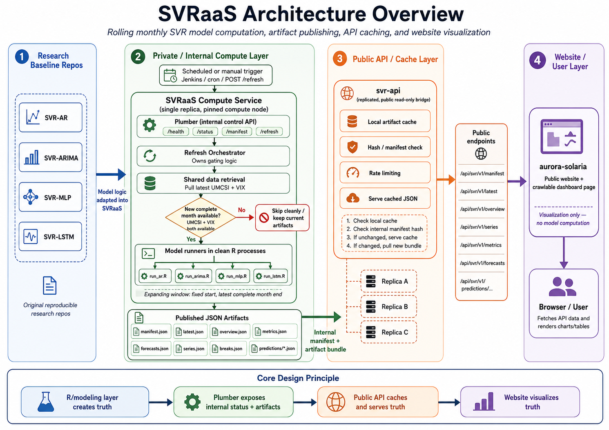

# SVR Dashboard System Design Notes

## Diagram



## Purpose

The goal is to build a rolling public dashboard for the SVR modeling project. The dashboard should visualize results from the AR, ARIMA, MLP, and LSTM models and update as new monthly data becomes available.

The system should preserve a clean separation between:

- model computation
- artifact publication
- internal orchestration
- public API serving
- public website visualization

The public-facing website should not run model code. It should fetch already-generated dashboard artifacts and render them.

---

## High-Level Architecture

```text
SVR model layer
  ↓
R compute container
  ↓
JSON artifacts
  ↓
internal Plumber control/API layer
  ↓
public API bridge/cache layer
  ↓
aurora-solaria dashboard page
```

The intended flow is:

```text
New monthly data becomes available
  ↓
R compute layer detects valid complete data
  ↓
models run against expanded historical data
  ↓
results are exported as JSON artifacts
  ↓
Plumber exposes manifest/artifact status internally
  ↓
public API checks hashes and refreshes its local cache
  ↓
website dashboard fetches JSON from public API
  ↓
browser renders visualizations
```

---

## Core Design Decisions

### 1. Keep R/modeling separate from the public API

The R layer should focus on data retrieval, model execution, validation, and artifact creation.

The public API should not contain model logic. It should not know how AR, ARIMA, MLP, or LSTM work. Its job is to serve already-generated JSON artifacts.

This allows the model layer to change independently as long as it continues to output valid JSON artifacts matching the agreed contract.

---

### 2. Use an R compute service pinned to one Swarm node

The model computation should run in a single controlled service, likely pinned to one compute node.

```text
svr-compute
  replicas: 1
  placement: compute node
  access: internal only
```

This avoids multiple replicas trying to run expensive model jobs at the same time.

The compute layer is not designed for public traffic. It is a controlled internal service.

---

### 3. Use an orchestrator script instead of one giant model script

The R side should not be one massive script that sources everything into the same R session.

Instead, use an orchestrator pattern:

```text
refresh_orchestrator.R
  ├── fetch/validate data
  ├── determine whether a run is needed
  ├── run AR model
  ├── run ARIMA model
  ├── run MLP model
  ├── run LSTM model
  ├── collect outputs
  ├── validate artifacts
  └── publish final JSON bundle
```

Each model runner should be separate:

```text
run_ar.R
run_arima.R
run_mlp.R
run_lstm.R
```

The orchestrator owns the workflow. The model scripts should focus only on their own model.

---

### 4. Run each model in a clean R process

Because the current workflow often involved restarting RStudio between models, the production workflow should avoid running all models in one polluted R session.

The orchestrator should launch each model runner in a separate clean R process.

Conceptually:

```text
orchestrator
  → clean R process: AR
  → clean R process: ARIMA
  → clean R process: MLP
  → clean R process: LSTM
```

This reduces memory contamination, stale variables, TensorFlow/Keras state issues, and model-to-model side effects.

---

### 5. The orchestrator owns gating logic

The trigger only asks the system to check whether a model refresh should happen.

The orchestrator decides whether the refresh actually runs.

The gating logic should check:

- whether a new complete monthly observation is available
- whether both UMCSI and VIX are available for the target month
- whether the target month is newer than the last successful run
- whether the aligned data has missing values
- whether another model refresh is already running
- whether the expanded data window is valid

The orchestrator should skip cleanly if the data is not ready.

---

### 6. Models should use a dynamic expanded data window

The current fixed-window model scripts need to be updated so they do not stop at the original capstone end date.

Instead of using a fixed end date, the model layer should build the dataset as:

```text
1990-01 through latest complete available month
```

A shared data-building function should handle:

- pulling UMCSI
- pulling VIX
- aggregating VIX to monthly level if needed
- aligning both series by month
- removing incomplete current-month data
- validating missing values
- computing SVR
- computing log(SVR)

All models should consume the same prepared dataset.

---

### 7. Export JSON artifacts from the model layer

The current model scripts export CSV files. For the dashboard system, the model layer should also export JSON artifacts.

The model code can make these artifacts granular.

Example artifact structure:

```text
artifacts/current/
  manifest.json
  latest.json
  overview.json
  metrics.json
  forecasts.json
  series.json
  breaks.json
  predictions/
    ar_h1.json
    ar_h3.json
    arima_h1.json
    arima_h3.json
    mlp_h1.json
    mlp_h3.json
    lstm_h1.json
    lstm_h3.json
```

CSV can still exist for research/archive purposes, but the public dashboard should consume JSON.

---

### 8. Use Plumber internally, not as the public API

Plumber is an R package that exposes R functions as HTTP endpoints.

In this design, Plumber belongs inside the internal `svr-compute` service.

It should expose internal endpoints such as:

```text
GET  /health
GET  /status
GET  /manifest
GET  /artifacts/current
POST /refresh
```

Plumber should not be the public dashboard API. It should be an internal control/status layer for the compute service.

---

### 9. Public API acts as a bridge/cache layer

The public API should sit between the browser and the internal compute service.

It should:

- expose only public read-only endpoints
- maintain its own local cache of JSON artifacts
- check the internal manifest/hash before pulling new artifacts
- avoid requesting the full bundle if nothing changed
- serve cached JSON to public users
- run as replicated stateless-ish services in Docker Swarm

Request flow:

```text
Public request hits svr-api
  ↓
svr-api checks local cached manifest
  ↓
svr-api checks internal manifest/hash
  ↓
if hash matches:
      serve local cached JSON
  ↓
if hash differs:
      pull new artifact bundle
      validate hash
      atomically update local cache
      serve updated JSON
```

Each `svr-api` replica can maintain its own local cache.

---

### 10. Use hash/version checks for artifact updates

The internal compute service should publish a manifest containing artifact version information.

Example:

```json
{
  "data_version": "2026-07",
  "generated_at": "2026-07-02T18:00:00-04:00",
  "artifact_hash": "sha256:abc123",
  "latest_observation_month": "2026-06",
  "bundle": "current.tar.gz"
}
```

The public API checks this manifest before pulling artifacts.

If the hash matches the local cache, no full artifact request is needed.

If the hash differs, the public API pulls the new artifact bundle.

---

## Component Responsibilities

### `svr-compute`

Internal R compute service.

Responsibilities:

- fetch latest data
- validate monthly data completeness
- run orchestrator
- run model scripts
- export JSON artifacts
- publish manifest/hash
- expose internal Plumber endpoints

Should be:

```text
internal only
single replica
pinned to compute node
not public-facing
```

---

### `refresh_orchestrator.R`

Main R workflow controller.

Responsibilities:

- check whether a refresh is needed
- enforce gating logic
- prevent duplicate runs
- launch model runners in clean R processes
- collect model outputs
- validate artifacts
- write final JSON bundle
- update manifest and run state

---

### Model runner scripts

Separate scripts:

```text
run_ar.R
run_arima.R
run_mlp.R
run_lstm.R
```

Responsibilities:

- consume prepared dynamic SVR dataset
- run one model family
- export model-specific JSON artifacts
- avoid deciding whether a full system refresh should happen

---

### Internal Plumber layer

Internal control/status API.

Responsibilities:

- expose health/status
- expose current manifest
- expose artifact bundle
- optionally trigger refresh
- provide internal service interface for Jenkins or the public API bridge

Not responsible for:

- serving public users directly
- running models on every dashboard request
- acting as the public website API

---

### Public `svr-api`

Public read-only API/cache bridge.

Responsibilities:

- expose public endpoints under the website domain
- serve cached JSON artifacts
- rate-limit public traffic
- check internal manifest/hash
- pull updated artifact bundles only when needed
- avoid model computation
- avoid direct dependency on R model code

Example public routes:

```text
/api/svr/v1/manifest
/api/svr/v1/latest
/api/svr/v1/overview
/api/svr/v1/series
/api/svr/v1/metrics
/api/svr/v1/forecasts
/api/svr/v1/breaks
/api/svr/v1/predictions/ar/h1
/api/svr/v1/predictions/mlp/h3
```

---

### `aurora-solaria`

Public website and dashboard frontend.

Responsibilities:

- host the crawlable SVR dashboard/research page
- render charts and tables
- fetch current JSON artifacts from the public API
- provide public explanation of the models and methodology
- avoid running model computation

The website should own the public presentation layer.

---

## Testing Plan

Before building the public API, test the internal compute service directly.

Initial test target:

```text
svr-compute
  R + Plumber
  mock orchestrator
  mock artifacts
```

Test with Postman:

```text
GET  /health
GET  /status
GET  /manifest
GET  /artifacts/current
POST /refresh
```

First milestone:

- Plumber runs inside the container
- Postman can hit endpoints
- `/refresh` can trigger a mock orchestrator
- mock artifacts are written
- `/manifest` returns a valid hash/version
- artifact endpoints return valid JSON

Only after this is working should the public API bridge be built.

---

## First Implementation Priorities

### Step 1: Dynamic data window

Update the model-side data retrieval/preparation so the SVR dataset expands through the latest complete available month.

This is separate from trigger logic.

Goal:

```text
1990-01 through latest complete available month
```

---

### Step 2: Orchestrator skeleton

Create a mock orchestrator that:

- checks fake/latest data availability
- checks run state
- runs placeholder model scripts
- writes mock JSON artifacts
- writes manifest/hash

---

### Step 3: Internal Plumber service

Create the `svr-compute` container with Plumber endpoints for:

```text
/health
/status
/manifest
/refresh
/artifacts/current
```

Test with Postman before exposing anything publicly.

---

### Step 4: Real model runners

Adapt each model into a runner script:

```text
run_ar.R
run_arima.R
run_mlp.R
run_lstm.R
```

Each runner should consume the shared dynamic dataset and export JSON artifacts.

---

### Step 5: Public API bridge/cache

Build the public API only after the internal compute service and artifacts are stable.

The public API should:

- check internal manifest/hash
- maintain local cache
- pull artifacts only when the hash changes
- serve cached JSON publicly
- apply rate limiting

---

## Main Design Principle

The system should remain layered:

```text
R/modeling layer creates truth.
Internal Plumber layer exposes status and artifacts.
Public API caches and serves truth.
aurora-solaria visualizes truth.
```

The public dashboard should never cause model computation directly.
